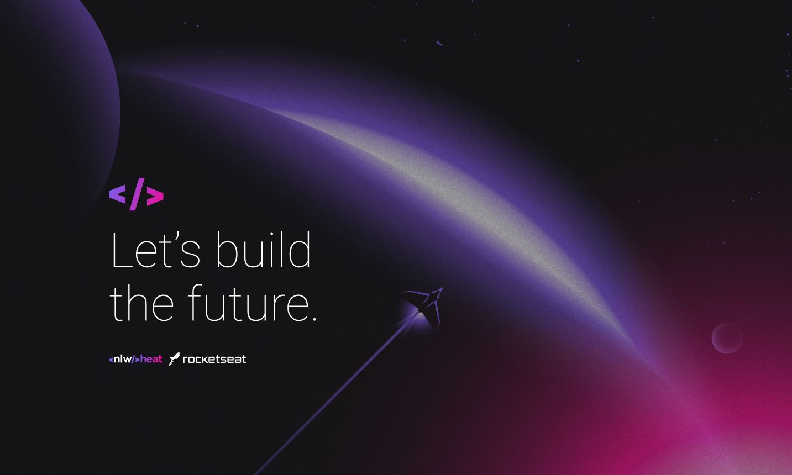
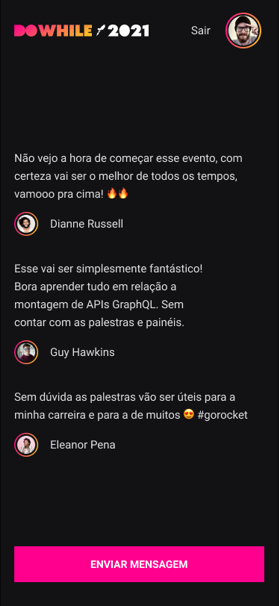
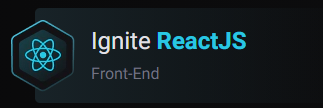
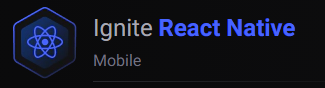
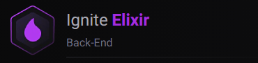
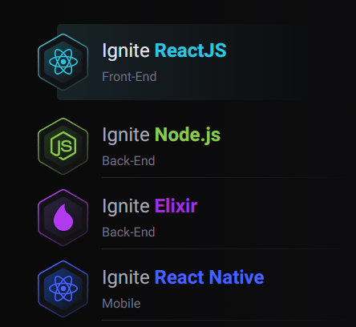

<h1 align="center">NLW Heat</h1>

  

  <a href="#-sobre">Sobre</a>&nbsp;&nbsp;&nbsp;|&nbsp;&nbsp;&nbsp;
  <a href="#-projeto">Projeto</a>&nbsp;&nbsp;&nbsp;|&nbsp;&nbsp;&nbsp;
  <a href="#-tecnologias">Tecnologias</a>&nbsp;&nbsp;&nbsp;|&nbsp;&nbsp;&nbsp;
  <a href="#-licença">Licença</a>&nbsp;&nbsp;&nbsp;|&nbsp;&nbsp;&nbsp;
  <a href="#-autor">Autor</a>

  
  

## ✨ Sobre

Projeto desenvolvido na NLW-Heat, evento organizado pela Rocketseat para ajudar a comunidade a ir par ao próximo nível.
O conteúdo do NLW é totalmente prático. E foi desenvolvida uma aplicação completa do início ao fim, pra aprender de forma eficiente e expandir o portfólio.
O NLW conta com uma comunidade exclusiva e enorme no Discord, onde todos interagem e ajudam muito quem está com dúvidas.

## ✨ Projeto

  
  <!--  -->

Os projetos desenvolvidos tiveram como foco fazer aplicações que comunicam entre si, mantendo sincronia e consistência dos dados.

### Aula 1    

- [Backend](https://github.com/diegohfcelestino/nlw_heat/tree/main/node)
Criamos o backend da aplicação utilizando NodeJS. Nesse projeto utilizou o Typescript, que auxilia no aumento da produtividade em desenvolvimento, utilizamos o Prisma ORM, para trabalhar com banco de dados e Socket.IO para trabalhar comunicação em tempo real.

### Aula 2    

- [Frontend](https://github.com/diegohfcelestino/nlw_heat/tree/main/react-js)
Nessa aula criamos o front-end web da nossa aplicação utilizando ReactJS. Além disso, criamos nosso projeto utilizando o Vite, uma ferramenta extremamente performática, TypeScript e CSS modules. Construímos toda interface da aplicação do zero com Flexbox e Grid System, além de criar animações utilizando Framer Motion.

### Aula 3    

- [Mobile](https://github.com/diegohfcelestino/nlw_heat/tree/main/react-js)
Nessa aula criamos o front-end mobile da nossa aplicação utilizando React Native, criamos nosso projeto utilizando TypeScript e Expo que proporciona muita produtividade no desenvolvimento. Também construímos a interface da aplicação do zero, além de criar animações utilizando o Moti, AsyncStorage e integração em tempo real com socket.io.

### Aula 4    

- [Microserviço](https://github.com/diegohfcelestino/nlw_heat/tree/main/heat_tags)
Na quarta aula criamos um microserviço em Elixir responsável por gerar a nuvem de tags das mensagens enviadas na aplicação desenvolvida nos dias anteriores. Usamos conceitos de concorrência e paralelismo para a contagem de tags, e um processo que executa todos os dias para a geração dessa nuvem de tags. Utilizamos o Phoenix, Ecto, o módulo Task a lib Quantum e diversos conceitos do Elixir.

## ✨ Tecnologias

- [Node](https://nodejs.org/en/)
- [React](https://reactjs.org/)
- [React-Native](https://reactjs.org/)
- [Elixir](https://reactjs.org/)
  

O projeto pode ser clonado e executado localmente.

> Obs.: Estes projetos tem autenticação via OAuth com o GitHub

## 📄 Licença

Esse projeto está sob a licença MIT.

---

## Autor
Feito por **Diego Henrique Ferreira** durante a NLW - Heat da [Rocketseat](https://www.rocketseat.com.br/).
Entre em contato!

👋🏻 &nbsp;[Participe da comunidade!](https://discordapp.com/invite/gCRAFhc)